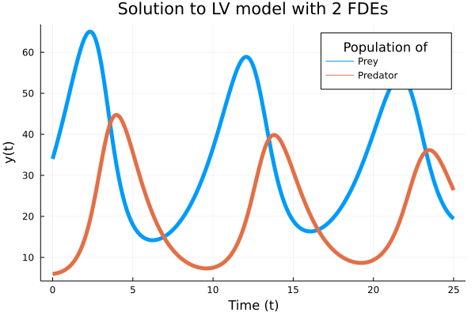
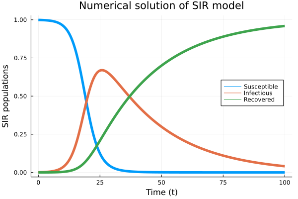
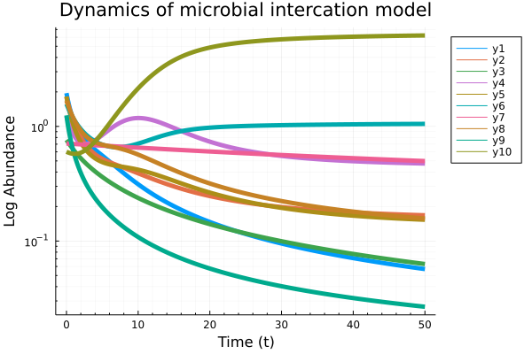

# API

## Example 1: [Fractional nonlinear equation](https://link.springer.com/article/10.1023/B:NUMA.0000027736.85078.be)

```math
0<\beta\leq1
```
subject to the initial condition
```math
y(0)=0
```
The exact solution is
```math
y(t)=t^8-3t^{4+\beta/2}+9/4t^\beta
```

```julia
using FdeSolver
using SpecialFunctions
using Plots

## inputs
tSpan = [0, 1] # [intial time, final time]
y0 = 0         # intial value
β = 0.9        # order of the derivative

## Equation
F(t, n, β, y)=(40320 ./ gamma(9 - β) .* t[n] .^ (8 - β) .- 3 .* gamma(5 + β / 2)
           ./ gamma(5 - β / 2) .* t[n] .^ (4 - β / 2) .+ 9/4 * gamma(β + 1) .+
           (3/2 .* t[n] .^ (β / 2) .- t[n] .^ 4) .^ 3 .- y[n] .^ (3/2))

## Numerical solution
t, Yapp = FDEsolver(F, tSpan, y0, β, nothing)

## Plot
plot(t, Yapp, linewidth = 5, title = "Solution of a 1D fractional IVP",
     xaxis = "Time (t)", yaxis = "y(t)", label = "Approximation", legend = :topleft)
plot!(t, t -> (t.^8 - 3 * t .^ (4 + β / 2) + 9/4 * t.^β),
      lw = 3, ls = :dash, label = "Exact solution")
```


## Example 2: [Lotka-Volterra-predator-prey](https://mc-stan.org/users/documentation/case-studies/lotka-volterra-predator-prey.html)

```julia
using FdeSolver
using Plots

## inputs
tSpan = [0, 25] # [intial time, final time]
y0 = [34, 6] # initial values
β = [0.98, 0.99] # order of derivatives

## ODE model

par = [0.55, 0.028, 0.84, 0.026] # model parameters

function F(t, n, β, y, par)

    α1=par[1] #growth rate of the prey population
    β1=par[2] #rate of shrinkage relative to the product of the population sizes
    γ=par[3] #shrinkage rate of the predator population
    δ=par[4] #growth rate of the predator population as a factor of the product
             #of the population sizes

    u= y[n, 1] #population size of the prey species at time t[n]
    v= y[n, 2] #population size of the predator species at time t[n]

    F1 = α1 .* u .- β1 .* u .* v
    F2 = - γ .* v .+ δ .* u .* v

    [F1, F2]

end

## Solution
t, Yapp = FDEsolver(F, tSpan, y0, β, nothing, par)

## Plot
plot(t, Yapp, linewidth = 5, title = "Solution to LV model with 2 FDEs",
     xaxis = "Time (t)", yaxis = "y(t)", label = ["Prey" "Predator"])
     plot!(legendtitle = "Population of")
```



## Example 3: [SIR model](https://en.wikipedia.org/wiki/Compartmental_models_in_epidemiology)

One application of using fractional calculus is taking into account effects of [memory](https://journals.aps.org/pre/abstract/10.1103/PhysRevE.95.022409) in modeling including epidemic evolution.

By defining the Jacobian matrix, users can achieve a faster convergence based on the modified [Newton–Raphson](https://www.mdpi.com/2227-7390/6/2/16/htm) method.

```julia
using FdeSolver
using Plots

## inputs
I0 = 0.001 #intial value of infected
tSpan = [0, 100] # [intial time, final time]
y0 = [1 - I0, I0, 0] # initial values [S0,I0,R0]
α = [1, 1, 1] # order of derivatives
h = 0.1 # step size of computation (default=0.01)

## ODE model
par = [0.4, 0.04] # parameters [β, recovery rate]

function F(t, n, α, y, par)

    #parameters
    β = par[1] #infection rate
    γ = par[2] #recovery rate

    S = y[n, 1] #Susceptible
    I = y[n, 2] #Infectious
    R = y[n, 3] #Recovered

    #System equation
    dSdt = - β .* S .* I
    dIdt = β .* S .* I .- γ .* I
    dRdt = γ .* I

    return [dSdt, dIdt, dRdt]

end

## Jacobian of ODE system
function JacobF(t, n, α, y, par)

    # parameters
    β = par[1] #infection rate
    γ = par[2] #recovery rate

    S = y[n, 1] #Susceptible
    I = y[n, 2] #Infectious
    R = y[n, 3] #Recovered

    # System equation
    J11 = - β * I
    J12 = - β * S
    J13 =  0
    J21 =  β * I
    J22 =  β * S - γ
    J23 =  0
    J31 =  0
    J32 =  γ
    J33 =  0

    J = [J11 J12 J13
         J21 J22 J23
         J31 J32 J33]

    return J

end

## Solution and Plot
t, Yapp = FDEsolver(F, tSpan, y0, α, JacobF, par, h = h)

plot(t, Yapp, linewidth = 5, title = "Numerical solution of SIR model",
     xaxis = "Time (t)", yaxis = "SIR populations", label=["Susceptible" "Infectious" "Recovered"], legend = :right)
```



## Example 4: [Dynamics of interaction of N species microbial communities](https://www.biorxiv.org/content/10.1101/2021.09.01.458486v1.abstract)

The impact of ecological memory on the dynamics of interacting communities can be quantified by solving fractional form ODE systems.

```julia
using FdeSolver
using Plots

## inputs
tSpan = [0, 50]       # time span
h = 0.1               # time step
N = 10                # number of species
β = ones(N)           # order of derivatives
X0 = 2*rand(N)        # initial abundances

## System definition

# Parametrisation
par = [2,
      2*rand(N),
      rand(N),
      4*rand(N,N),
       N]

function F(t, n, β, x, par)
    l = par[1] # Hill coefficient
    b = par[2] # growth rates
    k = par[3] # death rates
    K = par[4] # inhibition matrix
    N = par[5] # number of species

# ODE
    Fun = zeros(N)
    for i in 1:N
    # inhibition functions
    f = prod(K[i,1:end .!= i] .^ l ./
             (K[i,1:end .!= i] .^ l .+ x[n, 1:end .!= i] .^l))
    # System of equations
    Fun[i] = x[n, i] .* (b[i] .* f .- k[i] .* x[n, i])
    end

    return Fun

end

## numerical solution
t, Xapp = FDEsolver(F, tSpan, X0, β, nothing, par, h = h, nc = 3, tol = 10^(-8))

## plot
plot(t, Xapp, linewidth = 5,
     title = "Dynamics of microbial intercation model",
     xaxis = "Time (t)")
     yaxis!("Log Abundance", :log10, minorgrid = true)
```


